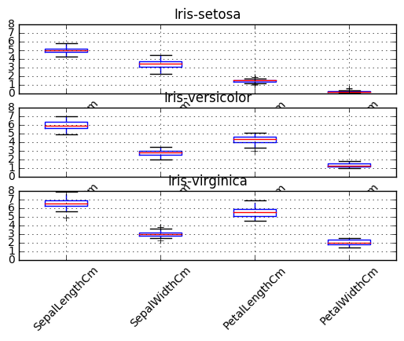
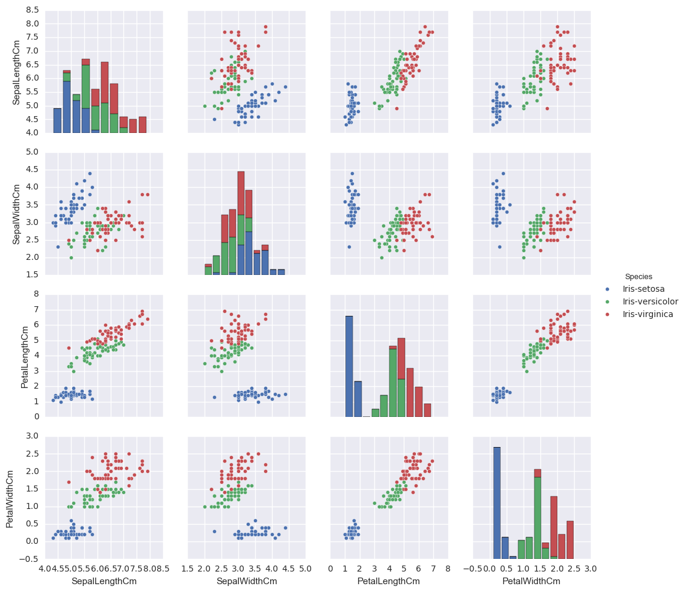

## Live Assignment 13
#### Chris Donlan
#### 11/1/16
#### MSDS 6306


```python
%matplotlib inline 
import matplotlib
```

#### Question 1


```python
#Part A
my_list = [45.4, 44.2, 36.8, 35.1, 39.0, 60.0, 47.4, 41.1, 45.8, 35.6]
my_list[4]
```


    39.0


```python
#Part B
my_list.append(55.2)
my_list
```


    [45.4, 44.2, 36.8, 35.1, 39.0, 60.0, 47.4, 41.1, 45.8, 35.6, 55.2]


```python
#Part C
my_list.pop(5)
my_list
```


    [45.4, 44.2, 36.8, 35.1, 39.0, 47.4, 41.1, 45.8, 35.6, 55.2]


```python
#Part D
for i in my_list:
    if i > 45:
        print(i)
```

    45.4
    47.4
    45.8
    55.2
    

#### Question 2


```python
#Part A
import numpy
```


```python
#Part B
np_array = numpy.array([45.4, 44.2, 36.8, 35.1, 39.0, 60.0, 47.4, 41.1, 45.8, 35.6])
np_array
```


    array([ 45.4,  44.2,  36.8,  35.1,  39. ,  60. ,  47.4,  41.1,  45.8,  35.6])


```python
#Part C
numpy.mean(np_array)
```


    43.040000000000006


```python
numpy.std(np_array)
```


    7.0611897014596625


```python
#Part D
comprehension = [round(x,3) for x in np_array if x <= 45]
comprehension
```


    [44.200000000000003,
     36.799999999999997,
     35.100000000000001,
     39.0,
     41.100000000000001,
     35.600000000000001]


```python
#Part E
numpy.max(np_array)
```


    60.0


```python
numpy.min(np_array)
```


    35.100000000000001


### Question 3


```python
#Part A
import pandas
```


```python
#Part B
iris = pandas.read_csv("Iris.csv")
```


```python
#Part C
iris.head()
```


<div>
<table border="1" class="dataframe">
  <thead>
    <tr style="text-align: right;">
      <th></th>
      <th>Id</th>
      <th>SepalLengthCm</th>
      <th>SepalWidthCm</th>
      <th>PetalLengthCm</th>
      <th>PetalWidthCm</th>
      <th>Species</th>
    </tr>
  </thead>
  <tbody>
    <tr>
      <th>0</th>
      <td>1</td>
      <td>5.1</td>
      <td>3.5</td>
      <td>1.4</td>
      <td>0.2</td>
      <td>Iris-setosa</td>
    </tr>
    <tr>
      <th>1</th>
      <td>2</td>
      <td>4.9</td>
      <td>3.0</td>
      <td>1.4</td>
      <td>0.2</td>
      <td>Iris-setosa</td>
    </tr>
    <tr>
      <th>2</th>
      <td>3</td>
      <td>4.7</td>
      <td>3.2</td>
      <td>1.3</td>
      <td>0.2</td>
      <td>Iris-setosa</td>
    </tr>
    <tr>
      <th>3</th>
      <td>4</td>
      <td>4.6</td>
      <td>3.1</td>
      <td>1.5</td>
      <td>0.2</td>
      <td>Iris-setosa</td>
    </tr>
    <tr>
      <th>4</th>
      <td>5</td>
      <td>5.0</td>
      <td>3.6</td>
      <td>1.4</td>
      <td>0.2</td>
      <td>Iris-setosa</td>
    </tr>
  </tbody>
</table>
</div>


```python
#Part D
iris = iris.drop('Id', 1)
#confirm change
iris.head()
```


<div>
<table border="1" class="dataframe">
  <thead>
    <tr style="text-align: right;">
      <th></th>
      <th>SepalLengthCm</th>
      <th>SepalWidthCm</th>
      <th>PetalLengthCm</th>
      <th>PetalWidthCm</th>
      <th>Species</th>
    </tr>
  </thead>
  <tbody>
    <tr>
      <th>0</th>
      <td>5.1</td>
      <td>3.5</td>
      <td>1.4</td>
      <td>0.2</td>
      <td>Iris-setosa</td>
    </tr>
    <tr>
      <th>1</th>
      <td>4.9</td>
      <td>3.0</td>
      <td>1.4</td>
      <td>0.2</td>
      <td>Iris-setosa</td>
    </tr>
    <tr>
      <th>2</th>
      <td>4.7</td>
      <td>3.2</td>
      <td>1.3</td>
      <td>0.2</td>
      <td>Iris-setosa</td>
    </tr>
    <tr>
      <th>3</th>
      <td>4.6</td>
      <td>3.1</td>
      <td>1.5</td>
      <td>0.2</td>
      <td>Iris-setosa</td>
    </tr>
    <tr>
      <th>4</th>
      <td>5.0</td>
      <td>3.6</td>
      <td>1.4</td>
      <td>0.2</td>
      <td>Iris-setosa</td>
    </tr>
  </tbody>
</table>
</div>


```python
#Part E
iris_setosa = iris.loc[(iris.Species == 'Iris-setosa')]
iris_setosa.head()
```


<div>
<table border="1" class="dataframe">
  <thead>
    <tr style="text-align: right;">
      <th></th>
      <th>SepalLengthCm</th>
      <th>SepalWidthCm</th>
      <th>PetalLengthCm</th>
      <th>PetalWidthCm</th>
      <th>Species</th>
    </tr>
  </thead>
  <tbody>
    <tr>
      <th>0</th>
      <td>5.1</td>
      <td>3.5</td>
      <td>1.4</td>
      <td>0.2</td>
      <td>Iris-setosa</td>
    </tr>
    <tr>
      <th>1</th>
      <td>4.9</td>
      <td>3.0</td>
      <td>1.4</td>
      <td>0.2</td>
      <td>Iris-setosa</td>
    </tr>
    <tr>
      <th>2</th>
      <td>4.7</td>
      <td>3.2</td>
      <td>1.3</td>
      <td>0.2</td>
      <td>Iris-setosa</td>
    </tr>
    <tr>
      <th>3</th>
      <td>4.6</td>
      <td>3.1</td>
      <td>1.5</td>
      <td>0.2</td>
      <td>Iris-setosa</td>
    </tr>
    <tr>
      <th>4</th>
      <td>5.0</td>
      <td>3.6</td>
      <td>1.4</td>
      <td>0.2</td>
      <td>Iris-setosa</td>
    </tr>
  </tbody>
</table>
</div>


```python
#Part F
iris.describe()
```


<div>
<table border="1" class="dataframe">
  <thead>
    <tr style="text-align: right;">
      <th></th>
      <th>SepalLengthCm</th>
      <th>SepalWidthCm</th>
      <th>PetalLengthCm</th>
      <th>PetalWidthCm</th>
    </tr>
  </thead>
  <tbody>
    <tr>
      <th>count</th>
      <td>150.000000</td>
      <td>150.000000</td>
      <td>150.000000</td>
      <td>150.000000</td>
    </tr>
    <tr>
      <th>mean</th>
      <td>5.843333</td>
      <td>3.054000</td>
      <td>3.758667</td>
      <td>1.198667</td>
    </tr>
    <tr>
      <th>std</th>
      <td>0.828066</td>
      <td>0.433594</td>
      <td>1.764420</td>
      <td>0.763161</td>
    </tr>
    <tr>
      <th>min</th>
      <td>4.300000</td>
      <td>2.000000</td>
      <td>1.000000</td>
      <td>0.100000</td>
    </tr>
    <tr>
      <th>25%</th>
      <td>5.100000</td>
      <td>2.800000</td>
      <td>1.600000</td>
      <td>0.300000</td>
    </tr>
    <tr>
      <th>50%</th>
      <td>5.800000</td>
      <td>3.000000</td>
      <td>4.350000</td>
      <td>1.300000</td>
    </tr>
    <tr>
      <th>75%</th>
      <td>6.400000</td>
      <td>3.300000</td>
      <td>5.100000</td>
      <td>1.800000</td>
    </tr>
    <tr>
      <th>max</th>
      <td>7.900000</td>
      <td>4.400000</td>
      <td>6.900000</td>
      <td>2.500000</td>
    </tr>
  </tbody>
</table>
</div>


```python
#Part G
iris_groupby = iris.groupby(iris['Species'])
```


```python
iris_groupby.head()
```


<div>
<table border="1" class="dataframe">
  <thead>
    <tr style="text-align: right;">
      <th></th>
      <th>SepalLengthCm</th>
      <th>SepalWidthCm</th>
      <th>PetalLengthCm</th>
      <th>PetalWidthCm</th>
      <th>Species</th>
    </tr>
  </thead>
  <tbody>
    <tr>
      <th>0</th>
      <td>5.1</td>
      <td>3.5</td>
      <td>1.4</td>
      <td>0.2</td>
      <td>Iris-setosa</td>
    </tr>
    <tr>
      <th>1</th>
      <td>4.9</td>
      <td>3.0</td>
      <td>1.4</td>
      <td>0.2</td>
      <td>Iris-setosa</td>
    </tr>
    <tr>
      <th>2</th>
      <td>4.7</td>
      <td>3.2</td>
      <td>1.3</td>
      <td>0.2</td>
      <td>Iris-setosa</td>
    </tr>
    <tr>
      <th>3</th>
      <td>4.6</td>
      <td>3.1</td>
      <td>1.5</td>
      <td>0.2</td>
      <td>Iris-setosa</td>
    </tr>
    <tr>
      <th>4</th>
      <td>5.0</td>
      <td>3.6</td>
      <td>1.4</td>
      <td>0.2</td>
      <td>Iris-setosa</td>
    </tr>
    <tr>
      <th>50</th>
      <td>7.0</td>
      <td>3.2</td>
      <td>4.7</td>
      <td>1.4</td>
      <td>Iris-versicolor</td>
    </tr>
    <tr>
      <th>51</th>
      <td>6.4</td>
      <td>3.2</td>
      <td>4.5</td>
      <td>1.5</td>
      <td>Iris-versicolor</td>
    </tr>
    <tr>
      <th>52</th>
      <td>6.9</td>
      <td>3.1</td>
      <td>4.9</td>
      <td>1.5</td>
      <td>Iris-versicolor</td>
    </tr>
    <tr>
      <th>53</th>
      <td>5.5</td>
      <td>2.3</td>
      <td>4.0</td>
      <td>1.3</td>
      <td>Iris-versicolor</td>
    </tr>
    <tr>
      <th>54</th>
      <td>6.5</td>
      <td>2.8</td>
      <td>4.6</td>
      <td>1.5</td>
      <td>Iris-versicolor</td>
    </tr>
    <tr>
      <th>100</th>
      <td>6.3</td>
      <td>3.3</td>
      <td>6.0</td>
      <td>2.5</td>
      <td>Iris-virginica</td>
    </tr>
    <tr>
      <th>101</th>
      <td>5.8</td>
      <td>2.7</td>
      <td>5.1</td>
      <td>1.9</td>
      <td>Iris-virginica</td>
    </tr>
    <tr>
      <th>102</th>
      <td>7.1</td>
      <td>3.0</td>
      <td>5.9</td>
      <td>2.1</td>
      <td>Iris-virginica</td>
    </tr>
    <tr>
      <th>103</th>
      <td>6.3</td>
      <td>2.9</td>
      <td>5.6</td>
      <td>1.8</td>
      <td>Iris-virginica</td>
    </tr>
    <tr>
      <th>104</th>
      <td>6.5</td>
      <td>3.0</td>
      <td>5.8</td>
      <td>2.2</td>
      <td>Iris-virginica</td>
    </tr>
  </tbody>
</table>
</div>


```python
iris_groupby.describe()
```


<div>
<table border="1" class="dataframe">
  <thead>
    <tr style="text-align: right;">
      <th></th>
      <th></th>
      <th>SepalLengthCm</th>
      <th>SepalWidthCm</th>
      <th>PetalLengthCm</th>
      <th>PetalWidthCm</th>
    </tr>
    <tr>
      <th>Species</th>
      <th></th>
      <th></th>
      <th></th>
      <th></th>
      <th></th>
    </tr>
  </thead>
  <tbody>
    <tr>
      <th rowspan="8" valign="top">Iris-setosa</th>
      <th>count</th>
      <td>50.000000</td>
      <td>50.000000</td>
      <td>50.000000</td>
      <td>50.000000</td>
    </tr>
    <tr>
      <th>mean</th>
      <td>5.006000</td>
      <td>3.418000</td>
      <td>1.464000</td>
      <td>0.244000</td>
    </tr>
    <tr>
      <th>std</th>
      <td>0.352490</td>
      <td>0.381024</td>
      <td>0.173511</td>
      <td>0.107210</td>
    </tr>
    <tr>
      <th>min</th>
      <td>4.300000</td>
      <td>2.300000</td>
      <td>1.000000</td>
      <td>0.100000</td>
    </tr>
    <tr>
      <th>25%</th>
      <td>4.800000</td>
      <td>3.125000</td>
      <td>1.400000</td>
      <td>0.200000</td>
    </tr>
    <tr>
      <th>50%</th>
      <td>5.000000</td>
      <td>3.400000</td>
      <td>1.500000</td>
      <td>0.200000</td>
    </tr>
    <tr>
      <th>75%</th>
      <td>5.200000</td>
      <td>3.675000</td>
      <td>1.575000</td>
      <td>0.300000</td>
    </tr>
    <tr>
      <th>max</th>
      <td>5.800000</td>
      <td>4.400000</td>
      <td>1.900000</td>
      <td>0.600000</td>
    </tr>
    <tr>
      <th rowspan="8" valign="top">Iris-versicolor</th>
      <th>count</th>
      <td>50.000000</td>
      <td>50.000000</td>
      <td>50.000000</td>
      <td>50.000000</td>
    </tr>
    <tr>
      <th>mean</th>
      <td>5.936000</td>
      <td>2.770000</td>
      <td>4.260000</td>
      <td>1.326000</td>
    </tr>
    <tr>
      <th>std</th>
      <td>0.516171</td>
      <td>0.313798</td>
      <td>0.469911</td>
      <td>0.197753</td>
    </tr>
    <tr>
      <th>min</th>
      <td>4.900000</td>
      <td>2.000000</td>
      <td>3.000000</td>
      <td>1.000000</td>
    </tr>
    <tr>
      <th>25%</th>
      <td>5.600000</td>
      <td>2.525000</td>
      <td>4.000000</td>
      <td>1.200000</td>
    </tr>
    <tr>
      <th>50%</th>
      <td>5.900000</td>
      <td>2.800000</td>
      <td>4.350000</td>
      <td>1.300000</td>
    </tr>
    <tr>
      <th>75%</th>
      <td>6.300000</td>
      <td>3.000000</td>
      <td>4.600000</td>
      <td>1.500000</td>
    </tr>
    <tr>
      <th>max</th>
      <td>7.000000</td>
      <td>3.400000</td>
      <td>5.100000</td>
      <td>1.800000</td>
    </tr>
    <tr>
      <th rowspan="8" valign="top">Iris-virginica</th>
      <th>count</th>
      <td>50.000000</td>
      <td>50.000000</td>
      <td>50.000000</td>
      <td>50.000000</td>
    </tr>
    <tr>
      <th>mean</th>
      <td>6.588000</td>
      <td>2.974000</td>
      <td>5.552000</td>
      <td>2.026000</td>
    </tr>
    <tr>
      <th>std</th>
      <td>0.635880</td>
      <td>0.322497</td>
      <td>0.551895</td>
      <td>0.274650</td>
    </tr>
    <tr>
      <th>min</th>
      <td>4.900000</td>
      <td>2.200000</td>
      <td>4.500000</td>
      <td>1.400000</td>
    </tr>
    <tr>
      <th>25%</th>
      <td>6.225000</td>
      <td>2.800000</td>
      <td>5.100000</td>
      <td>1.800000</td>
    </tr>
    <tr>
      <th>50%</th>
      <td>6.500000</td>
      <td>3.000000</td>
      <td>5.550000</td>
      <td>2.000000</td>
    </tr>
    <tr>
      <th>75%</th>
      <td>6.900000</td>
      <td>3.175000</td>
      <td>5.875000</td>
      <td>2.300000</td>
    </tr>
    <tr>
      <th>max</th>
      <td>7.900000</td>
      <td>3.800000</td>
      <td>6.900000</td>
      <td>2.500000</td>
    </tr>
  </tbody>
</table>
</div>


```python
#Part H
```


```python
iris_groupby.boxplot(return_type='axes',layout=(3,1),rot=45)
```


    OrderedDict([('Iris-setosa',
                  <matplotlib.axes._subplots.AxesSubplot at 0x1f8941552b0>),
                 ('Iris-versicolor',
                  <matplotlib.axes._subplots.AxesSubplot at 0x1f895172d68>),
                 ('Iris-virginica',
                  <matplotlib.axes._subplots.AxesSubplot at 0x1f8951c4668>)])





```python
#Part I
import seaborn
seaborn.pairplot(iris,hue='Species')
```


    <seaborn.axisgrid.PairGrid at 0x1f8965299b0>




